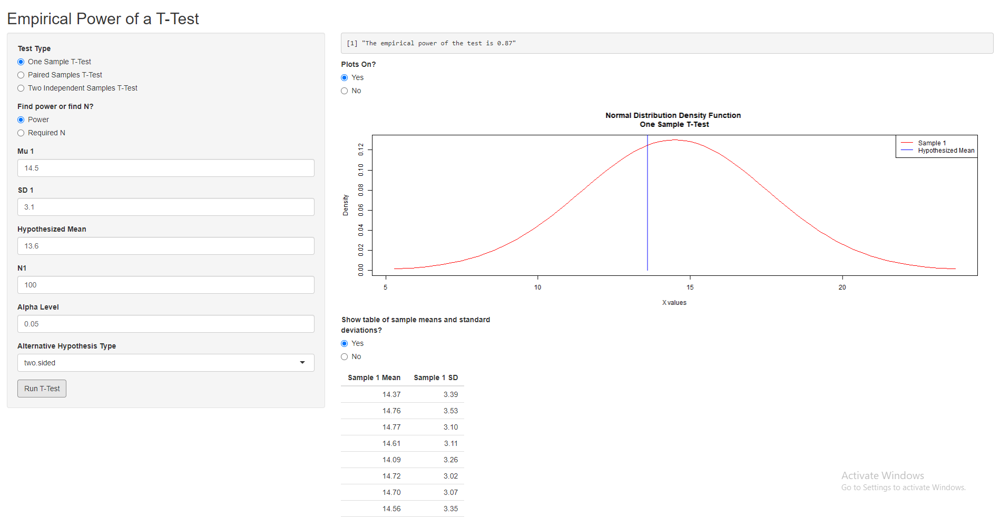
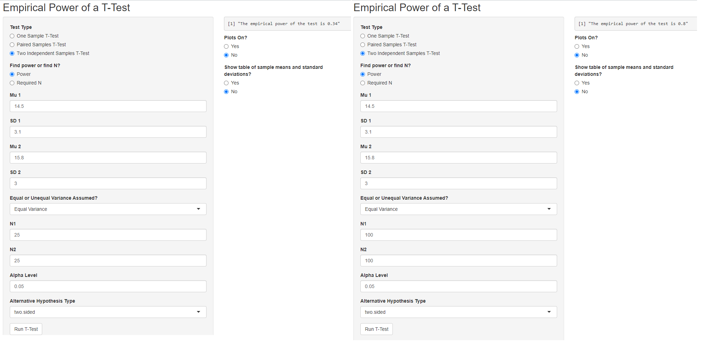
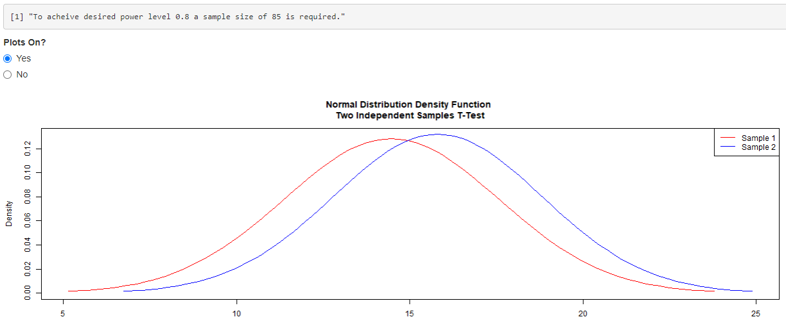

# Empirical Power Analysis Dashboard (R Shiny)


## Summary  
Interactive R Shiny application that uses simulation-based methods to estimate statistical power and required sample sizes for t-tests, supporting study design and decision-making in healthcare and public health research.

## Overview  
This project is an interactive R Shiny application that simulates and evaluates the empirical power of t-tests across different study design scenarios. It allows users to explore how sample size, effect size, variability, and significance level influence the likelihood of detecting meaningful effects.

This tool demonstrates my ability to build interactive statistical applications that translate simulation-based methods into practical insights for study design and healthcare analytics.

---

## Purpose  
In real-world research and public health settings, determining the appropriate sample size is critical for ensuring studies are adequately powered to detect meaningful effects.

This application helps users:
- Understand how statistical power changes under different assumptions  
- Explore trade-offs between sample size, effect size, and variability  
- Estimate minimum sample sizes required to achieve a desired power level  

---

## Key Features  
- Supports **one-sample, paired, and two-sample t-tests**  
- Estimates empirical power using Monte Carlo simulation (100 iterations per scenario)  
- Calculates required sample size to achieve a user-defined power threshold  
- Interactive input controls for:
  - Mean values  
  - Standard deviations  
  - Sample size(s)  
  - Significance level (alpha)  
  - Alternative hypothesis type  
- Dynamic outputs including power estimates and visualizations  

---

## Key Insight  
This tool demonstrates that statistical power is highly sensitive to sample size and variability. Even modest changes in assumptions can significantly impact study design decisions, highlighting the importance of simulation-based planning in research and healthcare analytics.

---

## Methods  
- Monte Carlo simulation for empirical power estimation  
- Repeated sampling (100 iterations per scenario)  
- Hypothesis testing using t-test procedures  
- Iterative search algorithm for determining minimum required sample size  

---

## Application Preview  

### Interactive Dashboard  
This interface allows users to select t-test type, define input parameters (means, standard deviations, sample size, and alpha), and dynamically generate empirical power estimates through simulation.


### Effect of Sample Size on Power  
This visualization demonstrates how increasing sample size improves the probability of detecting a true effect, highlighting the trade-off between study size and statistical reliability.


### Example Output  
This output displays the estimated empirical power based on simulated samples, illustrating how often a statistically significant result is observed under the specified assumptions.


---

## Tools & Technologies  
- R  
- Shiny  
- Statistical simulation  
- Hypothesis testing (t-tests)  

---

## Healthcare Relevance  
This application reflects core tasks in healthcare analytics and public health research, including:
- Study design support  
- Sample size planning  
- Interpretation of statistical evidence  
- Data-driven decision-making for research and program evaluation  

---

## How to Run  
1. Clone this repository  
2. Open `app.R` in RStudio  
3. Install required package (if needed):

```r
install.packages("shiny")
```

4. Run the application:

```r
shiny::runApp()
```

